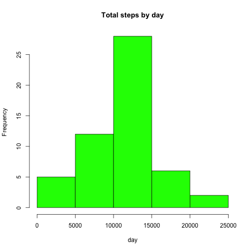
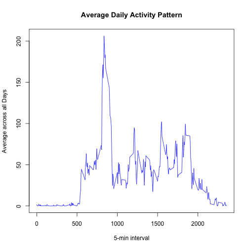
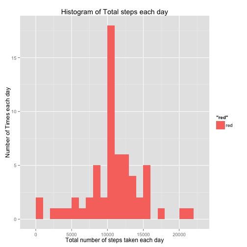
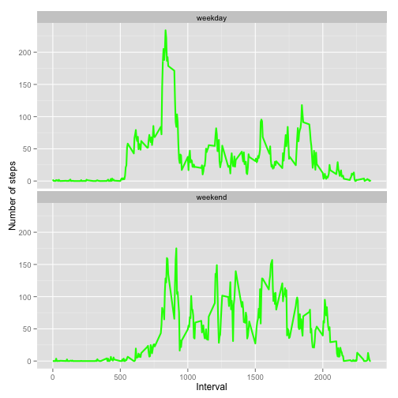

## INTRODUCTION
This assignment will be described in multiple parts. You will need to write a report that answers the questions detailed below. Ultimately, you will need to complete the entire assignment in a single R markdown document that can be processed by knitr and be transformed into an HTML file.

Throughout your report make sure you always include the code that you used to generate the output you present. When writing code chunks in the R markdown document, always use echo = TRUE so that someone else will be able to read the code. This assignment will be evaluated via peer assessment so it is essential that your peer evaluators be able to review the code for your analysis.

For the plotting aspects of this assignment, feel free to use any plotting system in R (i.e., base, lattice, ggplot2)

Fork/clone the GitHub repository created for this assignment. You will submit this assignment by pushing your completed files into your forked repository on GitHub. The assignment submission will consist of the URL to your GitHub repository and the SHA-1 commit ID for your repository state.

NOTE: The GitHub repository also contains the dataset for the assignment so you do not have to download the data separately.

Throughout your report make sure you always include the code that you used to generate the output you present. When writing code chunks in the R markdown document, always use echo = TRUE so that someone else will be able to read the code. This assignment will be evaluated via peer assessment so it is essential that your peer evaluators be able to review the code for your analysis.

## Loading library
use echo = TRUE


```r
library(knitr)
library(ggplot2)
library(lattice)
opts_chunk$set(echo = TRUE, results = 'hold')
```

## Loading and Preprocessing data
Create the columns


```r
if(!file.exists("getdata-projectfiles-UCI HAR Dataset.zip")) {
        temp <- tempfile()
        download.file("http://d396qusza40orc.cloudfront.net/repdata%2Fdata%2Factivity.zip",temp)
        unzip(temp)
        unlink(temp)
}

data <- read.csv("activity.csv")
```

## Process/Transform the data into format suitable for analysis


```r
data <- read.csv("activity.csv", header = TRUE, sep = ",",
                 colClasses = c("numeric", "character", "numeric"))
data$date <- as.Date(data$date, format = "%Y-%m-%d")
data$interval <- as.factor(data$interval)
activity <- read.csv("activity.csv")
```

## What is the mean total number of steps taken per day?
1. Make a histogram of the total number of steps taken each day
2. Calculate and report the mean and median total number of steps taken each day

Calculate total steps per day using aggregate function


```r
StepsTotal <- aggregate(steps ~ date, data = activity, 
                sum, na.rm = TRUE)
```

Make a histogram of the total number of steps taken each day

## Histogram

```r
hist(StepsTotal$steps, main = "Total steps by day", 
     xlab = "day", col = "green")
```

<<<<<<< HEAD
<<<<<<< HEAD
 
=======

>>>>>>> FETCH_HEAD
=======

>>>>>>> FETCH_HEAD

Finding the mean and median 

```r
mean(StepsTotal$steps)
median(StepsTotal$steps)
```

```
## [1] 10766.19
## [1] 10765
```
mean
[1] 10766.19
median
[1] 10765

## What is the average daily activity pattern?
1. Make a time series plot (ie type = "l") of the 5 minute interval (x-axis) and the average number of steps taken, averaged across all days (y-axis)

Get mean of steps and time intervals


```r
time_series <- tapply(activity$steps, activity$interval, mean, na.rm = TRUE)
plot(row.names(time_series), time_series, type = "l", xlab = "5-min interval", 
    ylab = "Average across all Days", main = "Average Daily Activity Pattern", 
    col = "blue")
```

<<<<<<< HEAD
<<<<<<< HEAD
 
=======

>>>>>>> FETCH_HEAD
=======

>>>>>>> FETCH_HEAD
2. Which 5-minute interval, on average across all the days in the dataset, contains the maximum number of steps?


```r
max_interval <- which.max(time_series)
names(max_interval)
```

```
## [1] "835"
```
Ans: 835

## Imputing missing values
Note that there are a number of days/intervals where there are missing values (coded as NA). The presence of missing days may introduce bias into some calculations or summaries of the data.

1. Calculate and report the total number of missing values in the dataset (i.e. the total number of rows with NAs)


```r
missing <- sum(is.na(data$steps))
```
Ans: Missing is 2304

2. Devise a strategy for filling in all of the missing values in the dataset. The strategy does not need to be sophisticated. For example, you could use the mean/median for that day, or the mean for that 5-minute interval, etc.

Create function fill.na and fill in missing values with mean values
3. New dataset with missing data filled in


```r
average <- aggregate(steps ~ interval, data = activity, FUN = mean)
fill.value <- function(steps, interval) {
    filled <- NA
    if (!is.na(steps)) 
        filled <- c(steps) else filled <- (average[average$interval == interval, "steps"])
    return(filled)
}
filled.data <- data
filled.data$steps <- mapply(fill.value, filled.data$steps, filled.data$interval)
```

4. Make a histogram of the total number of steps taken each day. 


```r
total.steps <- tapply(filled.data$steps, filled.data$date, FUN = sum)
qplot(total.steps, binwidth = 1000, xlab = "Total number of steps taken each day", ylab = "Number of Times each day", fill = "red", main = "Histogram of Total steps each day")
```

<<<<<<< HEAD
<<<<<<< HEAD
 
=======

>>>>>>> FETCH_HEAD
=======

>>>>>>> FETCH_HEAD

Calculate Mean and Median total number of steps taken per day


```r
mean(total.steps)
median(total.steps)
```

```
## [1] 10766.19
## [1] 10766.19
```
## mean(total.steps)
[1] 10766.19
## median(total.steps)
[1] 10766.19

Do these values differ from the estimates from the first part of the assignment? What is the impact of imputing missing data on the estimates of the total daily number of steps?

Yes, these values differ from the estimates from the first part of the assignment. The mean is same but median values are higher after imputing missing values. The Original data had total number of steps taken which were missing values. When replacing missing steps values with mean steps, this increased average number of steps.

## Are there differences in activity patterns between weekdays and weekends?

For this part the weekdays() function may be of some help here. Use the dataset with the filled-in missing values for this part.

1. Create a new factor variable in the dataset with two levels – “weekday” and “weekend” indicating whether a given date is a weekday or weekend day.


```r
weekdays_steps <- function(data) {
    weekdays_steps <- aggregate(data$steps, by=list(interval = data$interval),
                          FUN=mean, na.rm=T)
    # convert to integers for plotting
    weekdays_steps$interval <- 
            as.integer(levels(weekdays_steps$interval)[weekdays_steps$interval])
    colnames(weekdays_steps) <- c("interval", "steps")
    weekdays_steps
}

data_by_weekdays <- function(data) {
    data$weekday <- 
            as.factor(weekdays(data$date)) 
    weekend_data <- subset(data, weekday %in% c("Saturday","Sunday"))
    weekday_data <- subset(data, !weekday %in% c("Saturday","Sunday"))
    
    weekend_steps <- weekdays_steps(weekend_data)
    weekday_steps <- weekdays_steps(weekday_data)
    
    weekend_steps$dayofweek <- rep("weekend", nrow(weekend_steps))
    weekday_steps$dayofweek <- rep("weekday", nrow(weekday_steps))
    
    data_by_weekdays <- rbind(weekend_steps, weekday_steps)
    data_by_weekdays$dayofweek <- as.factor(data_by_weekdays$dayofweek)
    data_by_weekdays
}

data_weekdays <- data_by_weekdays(data)
```

2. Make a panel plot containing a time series plot (i.e. type = "l") of the 5-minute interval (x-axis) and the average number of steps taken, averaged across all weekday days or weekend days (y-axis). See the README file in the GitHub repository to see an example of what this plot should look like using simulated data.

Plotting average number of steps on weekends and weekdays

<<<<<<< HEAD
<<<<<<< HEAD

```r
ggplot(data_weekdays, aes(x=interval, y=steps)) + 
        geom_line(color="green", size=1) + 
        facet_wrap(~ dayofweek, nrow=2, ncol=1) +
        labs(x="Interval", y="Number of steps") 
```

 

Weekday activity has highest peak, although weekend activity has more activity with more peaks.
=======
>>>>>>> FETCH_HEAD
=======
>>>>>>> FETCH_HEAD
